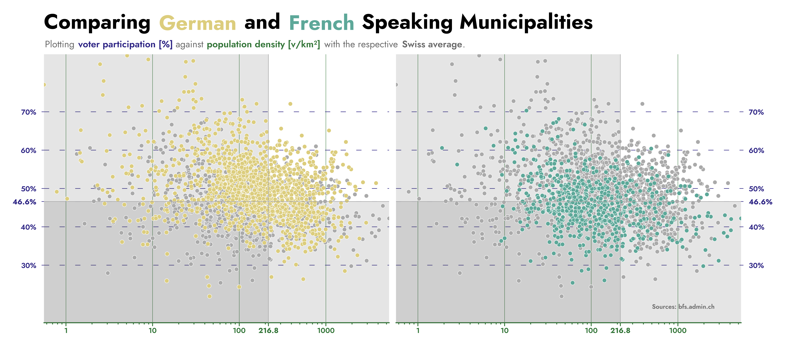

=========================================
Swiss Federal Elections 2023 - Who voted?
=========================================

On October 22, 2023, elections were held in Switzerland in which the entire parliament was newly elected. The results are what they are, more intriguing is the participation of the Swiss people.
Although, the Swiss parliament is only elected every four years, voter participation is notoriously low with a **Swiss average** of only **46.6%**. From 8.7 million people living in Switzerland,
5.4 million are entitled to vote, but only 2.5 million - less than a third of the population - actually did. 

Rural voting champions
""""""""""""""""""""""

The following chart depicts the voter participation of each municipality in comparison to the Swiss average.

.. figure:: ./charts/voter_participation_community.png
    :width: 100%
    :alt: Map of Switzerland depicting the voter participation compared to the Swiss average on a municipality level

There are a few quite obvious observations to be made: 

- The entire canton of Appenzell Innerrhoden (AI) has a very low participation. Due to them having reelected their Ständerat at a Landsgemeinde earlier in the year, only a Nationalrat had to be elected.
  Since the current Nationalrat of AI ran for reelection and no real opponent went into the race, many people stayed home on election day.
- Every municipality in the canton of Schaffhausen is above the Swiss average. This is most likely due to them having a fine of CHF 5.- for opting not to vote.
- There are some clear clusters of high voter participation in central Switzerland (Lucerne and Schwyz) and in Valais.

Quickly glancing over the chart, the map of Switzerland seems quite orange-heavy. There are many deep orange regions, but only few deep purple ones. 
This would suggest that more than half of the voters voted above the Swiss average. Obviously, that conclusion makes no sense. The only explanation would be that in the areas with very high
voter participation, only few voters actually live. This assumption is tested in the next chart, depicting the density of eligible voters per municipality.

.. figure:: ./charts/population_density_municipality.png
    :width: 100%
    :alt: Map of Switzerland depicting the voter population density on a municipality level

The clusters with very high voter participations, dicussed before are highlighted with yellow circles in this graph. Looking at these areas it becomes quickly visible that the regions where
people tend to vote most often, actually very few people live. This also explains why the map depicting voter participation seemed to have the Swiss average wrong. 
Looking at the legend in the top left corner, there is a huge gap in voter density comparing the average Swiss municipality to the big cities like Zurich, Basel or Geneva. 

Swissness equals *Rösti-Graben*?
""""""""""""""""""""""""""""""""

The so-called *Rösti-Graben* describes the language border between French and German speaking Switzerland. It is not only a lingual border, but also a cultural one. Often times clearly visible
in voting patterns; if the German speaking part mostly votes *yes*, the French speaking part often votes *no* and otherwise.

After having visualized the voter participation and density, the obvious question arises: Is there a *Rösti-Graben* in voter participation and density?

.. image:: ./charts/language_regions.png
    :width: 100%
    :alt: Map of Switzerland depicting what language is most often spoken on a municipality level

|pic1| |pic2|

.. |pic1| image:: ./charts/voter_participation_community.png
   :width: 49.7%

.. |pic2| image:: ./charts/population_density_municipality.png
   :width: 49.7%

Comparing the voter population density with the map depicting the language regions, there seems to be little to no difference in voter population density. Both language regions have 
a part that is mountanous (Alps and Jura) and not very habitable. But since the *Rösti-Graben* represents no physical border it would be surprising to see a differnce in voter
density. But, when comparing the voter participation with the language regions map, it seems as though the French speaking part of Switzerland is mostly colored in shades of purple,
while the German speaking part has some dashes of purple and mostly orange colored municipalities. This difference is clearly visualized in the next graph.

Seeing all the German and French speaking municipalities - side-by-side - classified by voter participation and population density, seems to be showing two things. German speaking
voters tend to participate more often and French speaking municipalities seem to be populated less densly. The second conclusion is in actuality an illusion, because there are 
simply many more German speaking municipalities than French speaking ones. But what actually holds up is the fact that German speaking voters tend to participate more frequently.
On average participation in German speaking municipalities is about **5%** higher than in French speaking ones. Therefore, it was shown that there acually exist a *Rösti-Graben* in 
voter participation.
